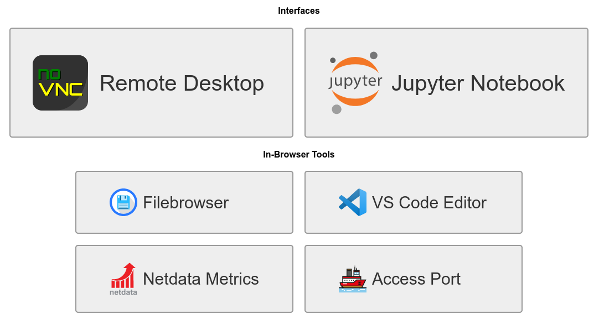
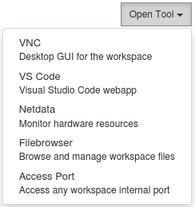

# Remote-Desktop

The Remote Desktop provides an in-browser GUI Ubuntu desktop experience as well
as quick access to supporting tools.

Two versions of Remote Desktop are available. _R_ includes R and RStudio.
_Geomatics_ extends _R_ with QGIS and various supporting libraries. You may
further customize your Remote Desktop workspace to suit your specific needs and
preferences.

_pip_, _conda_, and _npm_ are available to install various packages.

To launch the Remote Desktop or any of its supporting tools, create a Notebook
Server in [Kubeflow](./Kubeflow.md) and select one of the available versions in
the image dropdown. Then, connect to access the landing page.

_Remote Desktop_ brings you to the Desktop GUI. Click on the < on the left side
of the screen to expand a panel with options such as fullscreen and clipboard
access.

_Jupyter_ is a legacy interface that can be used to interact with Jupyter
Notebooks until storage integration with [JupyterLab images](./Jupyter.md)
becomes available.

You can access other tools and interfaces with the _Open Tool_ button in the top
right corner, or by returning to the landing page.

_VS Code_ brings you to the Visual Studio Code IDE.

_Netdata_ delivers in-depth interactive resource monitoring. Charts can be
panned by dragging them. You can also zoom in and out with
`SHIFT + mouse wheel`, or zoom to a selection by holding down `SHIFT` while
dragging.

_Filebrowser_ can be used to quickly explore the file system of the Remote
Desktop as well as to transfer files between the Remote Desktop and your
computer.

Finally, _Access Port_ provides in-browser access to anything served on a
specified port inside the Remote Desktop (internally accessible at e.g.
`localhost:8059`).

As with the other tools, this opens in a separate page in your browser. Your
namespace collaborators can also access this page if you send them the URL.

_Example: Accessing the Supervisor API at port 8059_

Remote Desktop is based on
[ml-tooling/ml-workspace](https://github.com/ml-tooling/ml-workspace).
