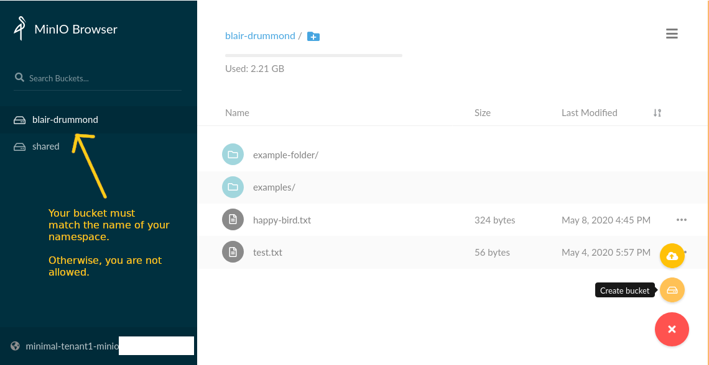
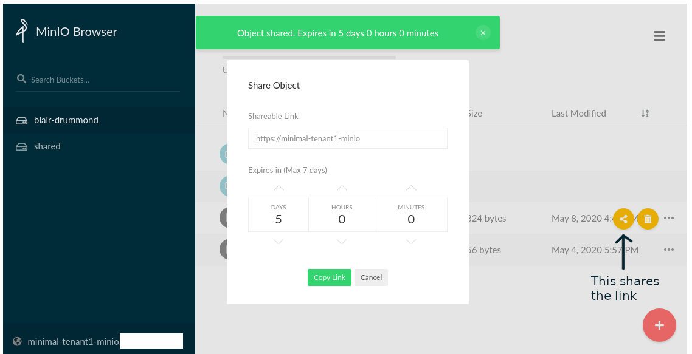

# Storage Types

The platform provides two main types of storage:

- Disk (also called Volumes on the Notebook Server creation screen)
- Bucket ("Blob" or S3 storage, provided through MinIO)

Depending on your use case, either may be most suitable:

|   Type |                                                                                                         Simultaneous Users |                                                   Speed | Total size               |
| -----: | -------------------------------------------------------------------------------------------------------------------------: | ------------------------------------------------------: | ------------------------ |
|   Disk |                                       One compute instance at a time (one notebook server, step in kubeflow pipeline, ...) |                        Fastest (throughput and latency) | <=512GB total per drive  |
| Bucket | Many compute instances at once (ex: multiple training processes on different notebook servers all accessing the same data) | Fast-ish (Fast download, modest upload, modest latency) | Infinite (within reason) |

<!-- prettier-ignore -->
??? info "If you're unsure which to choose, don't sweat it"
    These are guidelines, not an exact science - pick what sounds best now and run with it.  The best choice for a complicated usage is non-obvious and often takes hands-on experience, so just trying something will help.  For most situations both options work well even if they're not perfect, and remember that data can always be copied later if you change your mind.

## Disks

### Overview

Disks are the familiar SSD style file systems! When creating your notebook
server, you request them by adding Data Volumes to your notebook server. They
are automatically mounted at the directory you choose, and serve as a simple and
reliable way to preserve data attached to a Notebook Server. Even if you delete
your Notebook Server later, your disk will not be deleted. You can then mount
that same disk (with all its contents) to a new Notebook Server later.


<!-- prettier-ignore -->
??? info "Disks are never destroyed by default, but you pay for them whether they're attached to a Notebook Server or not"
    When you create a disk, you agree to [pay](#pricing) for the cost of that drive until it is destroyed, just like how you agree to pay for the CPU/RAM you request when making a Notebook Server.  Unlike with Notebook Server CPU/RAM, however, when you shut down a Notebook Server your disks are not deleted.  This is to let you reuse those drives, but means that when you shutdown a Notebook Server **you are still paying for the storage**.  Storage is [pretty cheap](#pricing) but can still add up - see [Deleting Disk Storage](#deleting-disk-storage) for more info.
    
As disks can be attached to a Notebook Server and reused, a typical usage pattern could be:

- At 9AM, create a Notebook Server (request 2CPU/8GB RAM and a 32GB attached
  disk)
- Do work throughout the day, saving results to the attached disk
- At 5PM, shut down your Notebook Server to avoid paying for it overnight
  - NOTE: The attached disk **is not destroyed** by this action
- At 9AM the next day, create a new Notebook Server and **attach your existing
  disk**
- Continue your work...

### Pricing

<!-- prettier-ignore -->
??? info "Pricing models are tentative and may change"
    As of writing, pricing is covered by the platform for initial users.  This guidance explains how things are expected to be priced priced in future, but this may change.

When mounting a disk, you get an
[Azure Manage Disk](https://azure.microsoft.com/en-us/pricing/details/managed-disks/).
The **Premium SSD Managed Disks** pricing shows the cost per disk based on size.
Note that you pay for the size of disk requested, not the amount of space you
are currently using.

### Deleting Disk Storage

This section is still under construction. If you need to delete disk storage
(the type of storage created with notebook servers), reach out to us in Slack.

## Buckets (via MinIO)

Buckets are slightly more complicated, but they are good at three things:

- **Large amounts of data**  
  Buckets can be huge: way bigger than hard drives. And they are still fast.
- **Accessible by multiple consumers at once** You can access the same data
  source from multiple Notebook Servers and pipelines at the same time without
  needing to duplicate the data
- **Sharing**  
  You can share files from a bucket by sharing a URL that you can get through a
  simple web interface. This is great for sharing data with people outside of
  your workspace.

### Accessing your Bucket

There are multiple ways to upload and download data from your MinIO buckets:

- [Mounted folders](#minio-mounted-folders-on-a-notebook-server) on a Notebook
  Server
- [MinIO web portal](#minio-web-portal)
- [MinIO command line tool](#minio-command-line-tool) `mc`
- [Other S3-Compliant Methods](#other-s3-compliant-methods)

These methods, described more below, have strengths and weaknesses for different
use cases, but **they are equivalent** with respect to the actual data stored.
You can:

- Upload a file using the mounted folder on a notebook server
- Rename that file using the web portal
- Download that file using the `mc` tool

and all steps will be working on **the same file**. This lets you mix and match
based on what is easiest for your task.

<!-- prettier-ignore -->
??? info "There are two different MinIO services"
    The examples below use the `minimal-tenant1` instance of MinIO, but there is also a second instance: `premium-tenant1`.  See [Bucket Types and Access Scopes](#bucket-types-and-access-scopes) for more details.  To use `premium-tenant1` in these examples, just substitute that name in for `minimal-tenant1`.

#### MinIO Mounted Folders on a Notebook Server

Automatically, all Notebook Servers have your MinIO storage mounted as
directories. This is located in `~/minio`:


These folders can be used like any other - you can copy files to/from using the
file browser, write from Python/R, etc. The only difference is that the data is
being stored in the MinIO service rather than on a local disk (and is thus
accessible wherever you can access your MinIO bucket, rather than just from the
Notebook Server it is attached to like a [Disk](#disks)).

<!-- prettier-ignore -->
??? warn "Copying into a MinIO folder then immediately accessing the file might cause trouble"
    There is currently a bug where files copied into a MinIO directory are sometimes not immediately available in the file browser.  They copy successfully and eventually appear in the folder system, but this may be delayed a few seconds or minutes.  If your use case needs you to copy files into a MinIO mounted folder and then access them immediately, you can still copy with the folder and then see the files using the [Web Portal](#minio-web-portal), [the mc tool](#minio-command-line-tool), or [Other S3 Compliant Methods](#other-s3-compliant-methods) to get immediate access to the file.

#### MinIO Web Portal

The MinIO service can be accessible through a
[web portal](https://minimal-tenant1-minio.covid.cloud.statcan.ca/). To sign in
using your existing credentials, use the "Log in with OpenID" button.


From this portal you can browse to your personal bucket, which has the same name
as your Kubeflow namespace (likely `firstname-lastname`):



This lets you browse, upload/download, delete, or share files.

#### MinIO Command Line Tool

MinIO provides the command line tool `mc` to access your data from a terminal.
`mc` can communicate with one or more MinIO instances to let you upload/download
files. For example:

<!-- prettier-ignore -->
??? info "To run the below example yourself, replace `BUCKETNAME`'s value with your first/last name"
    Ignore this text.  Required for CI...

```sh
#!/bin/sh

# The name of your bucket.  This MUST be the same as your namespace's name.
# Typically this is "firstname-lastname", but it might be different if working in a shared namespace
BUCKETNAME=firstname-lastname

# Get your personal credentials for the "minimal-tenant1" MinIO instance
# (this initializes $MINIO_URL, $MINIO_ACCESS_KEY, and $MINIO_SECRET_KEY environment variables)
source /vault/secrets/minio-minimal-tenant1

# Create a MinIO alias (called "minimal") for "minimal-tenant1" using your credentials
mc config host add minimal $MINIO_URL $MINIO_ACCESS_KEY $MINIO_SECRET_KEY

# Create a bucket under your name
# NOTE: You can *only* create buckets named the same as your namespace. Any
# other name will be rejected.

# Private bucket ("mb" = "make bucket")
mc mb minimal/${BUCKETNAME}

# Shared bucket
mc mb minimal/shared/${BUCKETNAME}

# There you go! Now you can copy over files or folders!
# Create test.txt (if it does not exist) and copy it to your bucket:
[ -f test.txt ] || echo "This is a test" > test.txt
mc cp test.txt minimal/${BUCKETNAME}/test.txt
```

Now open the [MinIO Web Portal](#minio-web-portal) or browse to
`~/minio/minimal-tenant1/private` to see your test file!

<!-- prettier-ignore -->
??? tip "`mc` can do a lot" 
    In addition to copying files, `mc` can do a lot more (like `mc ls minio-minimal/FIRSTNAME-LASTNAME` to list the contents of a bucket).  Check out the [mc docs](https://docs.min.io/docs/minio-client-complete-guide.html) or run `mc --help` for more information.

<!-- prettier-ignore -->
??? tip "See the example notebooks!"
    There is a template provided for connecting in `R`, `python`, or by the
    command line, provided in [jupyter-notebooks/self-serve-storage](https://github.com/StatCan/jupyter-notebooks/tree/master/self-serve-storage) (also auto-mounted to all jupyter notebook servers in `~/jupyter-notebook`). You can
    copy-paste and edit these examples! They should suit most of your needs.

#### Other S3-Compliant Methods

MinIO is S3 compliant - it uses the same standard as Amazon S3 and other bucket
services. Tools designed to use S3 will generally also work with MinIO, for
example Python packages and instructions on how to access files from S3. Some
examples of this are shown in
[jupyter-notebooks/self-serve-storage](https://github.com/StatCan/jupyter-notebooks/tree/master/self-serve-storage).

### Bucket Types and Access Scopes

Two types of buckets are available:

- **[Minimal](https://minimal-tenant1-minio.covid.cloud.statcan.ca):**  
  By default, use this one. It is backed by an SSD and provides a good balance
  of cost and performance.
- **[Premium](https://premium-tenant1-minio.covid.cloud.statcan.ca):**  
  Use this if you need high read/write speeds and don't mind paying ~2x the
  storage cost. These are somewhat faster than the minimal storage.

Generally if you aren't sure which you need, start with **Minimal**. You can
always change your mind if you see your work limited by file transfer speeds.

Within each bucket type, everyone has two storage locations they can use, each
providing different access scopes:

- Private:
  - Accessible only by someone within your namespace (typically only by you from
    your own notebook servers/remote desktop, unless you're working in a
    [shared namespace](./Collaboration.md#requesting-a-namespace))
  - Examples:
    - mounted as a drive in notebook server:
      `~/minio/minimal-tenant1/private/myfolder/myfile`
    - via `mc` tool/MinIO portal: `firstname-lastname/myfolder/myfile`
- Shared
  - Writable only by you, but readable by anyone with access to the platform.
    Great for sharing public data across teams
  - Examples:
    - mounted as a drive in notebook server:
      `~/minio/minimal-tenant1/shared/myfolder/myfile`
    - via `mc` tool/MinIO portal: `shared/firstname-lastname/myfolder/myfile`

<!-- prettier-ignore -->
??? info "You can see many directories in the shared MinIO bucket, but you can only write to your own"
    Everyone has read access to all folders in the `shared` MinIO bucket, but write permissions are always restricted to the owner.

### Sharing from Private Buckets

You can easily share individual files from a private bucket. Just use the
"share" option for a specific file and you will be provided a link that you can
send to a collaborator!



### Pricing

<!-- prettier-ignore -->
??? info "Pricing models are tentative and may change"
    As of writing, pricing is covered by the platform for initial users.  This guidance explains how things are expected to be priced priced in future, but this may change.

Exact pricing for MinIO resources are hard to state because they're prorated
across multiple users. In general though, the underlying storage is provided by
[Azure Manage Disks](https://azure.microsoft.com/en-us/pricing/details/managed-disks/)
and they give a rough guide for MinIO storage cost based on the MinIO instance:

- premium-tenant1:
  - See **Premium SSD Managed Disks**
- minimal-tenant1:
  - See **Standard SSD Managed Disks**
  - Typically 50% the cost of `premium-tenant1`
