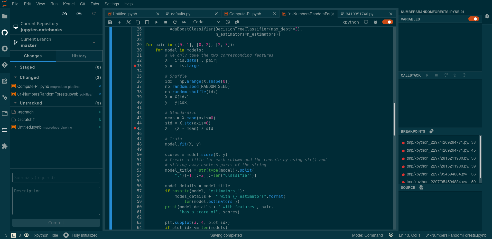

# Jupyter

## Expérience conviviale de R et Python

Jupyter vous donne des **bloc-notes** pour écrire votre code et faire des visualisations. 
Vous pouvez rapidement itérer, visualiser et partager vos analyses. Puisque Jupyter est exécuté
sur un serveur (que vous avez mis en place dans la dernière section), il vous permet d'effectuer 
de très grandes analyses sur un matériel centralisé! Ajoutez autant de puissance qu’il vous faut! 
Et puisque c’est dans le nuage, vous pouvez aussi le partager avec vos collègues.

### Explorez vos données

Jupyter offre un certain nombre de fonctionnalités (et nous pouvons en ajouter d’autres)

- Éléments visuels intégrés dans votre bloc-notes
- Volume de données pour le stockage de vos données
- Possibilité de partager votre espace de travail avec vos collègues


### Environnement de développement dans le navigateur

Créez pour explorer, et aussi pour écrire du code

- Linting et débogage
- Intégration Git
- Terminal intégré
- Thème clair/foncé (changer les paramètres en haut)



**Plus de renseignements sur Jupyter [ici](https://jupyter.org)**


## Commencez par les exemples

Lorsque vous avez démarré votre serveur, il a été chargé de modèles de bloc-notes.
Parmi les bons blocs-notes pour commencer, il y a `R/01-R-Notebook-Demo.ipynb` et ceux dans
dans `scikitlearn`. Les bloc-notes `pytorch` et `tensorflow` sont excellents si vous connaissez
l’apprentissage automatique. `mapreduce-pipeline` et `ai-pipeline` sont plus avancés.

??? danger "Certains bloc-notes ne fonctionnent que dans certaines versions de serveur"
    Par exemple, `gdal` ne fonctionne que dans l’image géomatique. Donc, si vous utilisez une autre
    image, un bloc-notes utilisant `gdal` pourrait ne pas fonctionner.
    
## Ajout de logiciels

Vous n’avez pas `sudo` dans Jupyter, mais vous pouvez utiliser 

```sh
conda install --use-local your_package_name
```

ou

```sh
pip install --user your_package_name
```


**N’oubliez pas de redémarrer votre noyau Jupyter par la suite, pour accéder à de nouvelles trousses.**

??? conseil "Assurez-vous de redémarrer le noyau Jupyter après l’installation d’un nouveau logiciel".
    Si vous installez un logiciel dans un terminal, mais que votre noyau Jupyter était déjà
    en cours d’exécution, il ne sera pas mis à jour.
    
??? conseil "Y a-t-il quelque chose que vous ne pouvez pas installer?"
    Si vous avez besoin d’installer quelque chose, communiquez avec nous 
    ou [ouvrir une question GitHub](https://github.com/StatCan/kubeflow-containers).
    Nous pouvons l’ajouter au logiciel par défaut.
 
 
# Entrer et sortir des données de Jupyter
 
Vous pouvez télécharger et charger des données vers ou depuis Jupyterhub directement dans le menu. 
Il y a un bouton de chargement en haut, et vous pouvez cliquer avec le bouton droit de la souris 
sur la plupart des fichiers ou dossiers pour les télécharger.


## Stockage partagé en compartiment

**L’autre option** est le stockage de gros volumes avec 
[Stockage d’objets](https://en.wikipedia.org/wiki/Object_storage).
Étant donné que le stockage est important pour les expérimentations, la diffusion 
et l’exploration des ensembles de données, une section lui est consacré


**Consultez la [section sur le stockage](/Stockage)**
