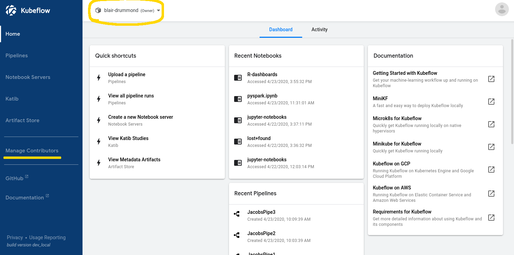

# D&eacute;marrer avec Kubeflow

## Que fait Kubeflow?

Kubeflow ex&eacute;cute vos **espaces de travail**. Vous pouvez avoir des serveurs de bloc-notes 
(appel&eacute;s serveurs Jupyter), et vous pouvez y cr&eacute;er des analyses en R et Python avec des
visuels interactifs. Vous pouvez enregistrer et charger des donn&eacute;es, t&eacute;l&eacute;charger des donn&eacute;es,
et cr&eacute;er des espaces de travail partag&eacute;s pour votre &eacute;quipe.

**Commen&ccedil;ons sans plus tarder!**

# Cr&eacute;er un serveur

## Se connecter &agrave; Kubeflow

- Connectez-vous au [portail Azure](https://portal.azure.com) **&agrave; l&#146;aide de vos
  justificatifs d&#146;identit&eacute; cloud.statcan**.
 
??? warning "Connectez-vous au portail Azure au moyen de vos justificatifs d&#146;identit&eacute; dans le nuage"
    Vous devez vous connecter au portail Azure **au moyen de vos justificatifs d&#146;identit&eacute; StatCan** :
    `prenom.nom@cloud.statcan.ca`. Vous pouvez le faire ici [sur le portail Azure](https://portal.azure.com).
    

- Apr&egrave;s avoir ouvert une session dans Azure, connectez-vous &agrave; [kubeflow](https://kubeflow.covid.cloud.statcan.ca)

??? failure "Pourquoi est-ce que je re&ccedil;ois le message "Param&egrave;tre URL manquant : code"?"
    Si vous essayez de vous connecter &agrave; Kubeflow et que vous obtenez le message 
    > Param&egrave;tre URL manquant : code

    c&#146;est parce que vous &ecirc;tes connect&eacute; avec le mauvais compte Azure. Vous devez vous connecter
    avec vos justificatifs d&#146;identit&eacute; dans le nuage.

    
    

- Allez &agrave; l&#146;onglet des serveurs Jupyter

- Cliquez ensuite sur **+ Nouveau serveur**.

## Configuration de votre serveur

- Vous recevrez un mod&egrave;le pour cr&eacute;er votre serveur de bloc-notes.
  **Nota :** Le nom doit &ecirc;tre en minuscules avec des tirets. **Pas d'espace ou de trait de soulignement.**

- **Vous devrez choisir une image** Vous voudrez probablement une image de :

    - **Apprentissage automatique**
    - **G&eacute;omatique**
    - **Minime**

- Si vous voulez utiliser un processeur graphique (GPU), v&eacute;rifiez si l&#146;image indique **CPU** ou **GPU**.
 
 
## Unit&eacute; centrale (CPU) et m&eacute;moire vive 

- Au moment de la r&eacute;daction du pr&eacute;sent document (21 avril 2020), il y a deux types d&#146;ordinateurs dans
  la grappe

  - **CPU :** D16s v3 `(16 unites centrales virtuelles, memoire vive de 64 Go)`
  - **GPU :** NC6s_v3 `(6 unites centrales virtuelles, memoire vive de 112 Go, 1 cartes graphiques)`
  
  Pour cette raison, si vous demandez trop de m&eacute;moire vive ou trop de CPU, il pourrait &ecirc;tre difficile
  ou impossible de satisfaire votre demande.
  
  Il est possible que plus tard (peut-&ecirc;tre lorsque vous lirez ceci), des appareils plus puissants soient
  disponibles, et que les restrictions soient moins strictes.
  
!!! note "Utilisez les GPU de mani&egrave;re responsable"
    Il y a moins d'appareils avec GPU que d'appareils avec CPU, alors utilisez-les de mani&egrave;re responsable.
    
    
## Stockage de vos donn&eacute;es

- Vous voudrez cr&eacute;er un volume de donn&eacute;es. Vous pouvez enregistrer votre travail dans ce volume de donn&eacute;es,
  et si vous &eacute;teignez votre serveur, vous pourrez simplement remonter vos anciennes donn&eacute;es
  en saisissant le nom de votre ancien disque. **Il est important que vous vous souveniez du
  nom du volume.**

 
!!! tip "Trouvez des anciens volumes en jetant un coup l'oeil &agrave; l&#146;option Existant"
    Lorsque vous cr&eacute;ez votre serveur, vous avez la possibilit&eacute; de r&eacute;utiliser un ancien volume
    ou d&#146;en cr&eacute;er un nouveau. Vous souhaiterez probablement r&eacute;utiliser votre ancien volume.
 
## Et... Cr&eacute;ez!!!

- Si vous &ecirc;tes satisfait des param&egrave;tres, vous pouvez maintenant cr&eacute;er le serveur! 
  Il se peut que cela prenne quelques minutes pour se mettre en route, selon les ressources 
  que vous avez demand&eacute;es. (Les GPU prennent plus de temps.)
 

!!! success "Votre serveur est en fonctionnement" 
    Si tout va bien, votre serveur devrait fonctionner! Vous aurez d&eacute;sormais
    la possibilit&eacute; de connecter et [d&#146;essayer Jupyter.](/1-Experiences/Jupyter)

 
# Partager votre espace de travail

Dans Kubeflow, chaque utilisateur dispose d&#146;un **espace de noms**. Cet espace vous appartient, 
et toutes vous ressources s'y trouvent. Si vous souhaitez collaborer avec quelqu&#146;un, vous
devez partager un espace de noms. Pour ce faire, pouvez partager votre propre
espace de noms ou, pr&eacute;f&eacute;rablement, **cr&eacute;er un espace de noms d&#146;&eacute;quipe**. 

## Cr&eacute;er un nouvel espace de noms partag&eacute;

Le lien pour cr&eacute;er un nouvel espace de noms est ici :
- &Agrave; FAIRE, IL N&#146;Y A PAS ENCORE DE LIEN.

## G&eacute;rer les contributeurs

Vous pouvez ajouter ou supprimer des personnes d&#146;un espace de noms 
que vous poss&eacute;dez &agrave; partir du menu **G&eacute;rer les contributeurs** dans Kubeflow.

!!! success "Vos coll&egrave;gues et vous pouvez maintenant partager l&#146;acc&egrave;s &agrave; un serveur!"
    Vous pouvez maintenant partager un serveur avec vos coll&egrave;gues! Essayez-le!
