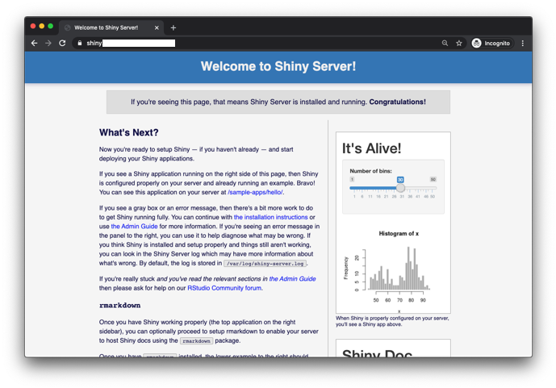

# D&eacute;ploiement de votre tableau de bord R-Shiny

Nous prenons en charge le serveur R-Shiny. Il tr&egrave;s facile de placer votre tableau de bord sur la plateforme.

## Envoyez simplement une demande d'extraction!

Il vous suffit d'envoyer une demande d'extraction &agrave; [notre r&eacute;pertoire de tableaux de bord R-Shiny](https://github.com/StatCan/R-dashboards). Placez votre r&eacute;pertoire dans un dossier portant le nom que vous voulez utiliser (p. ex. tableau-bord-qualit&eacute;-air). Nous l'approuverons et le mettrons en ligne.

Si vous avez d'autres biblioth&egrave;ques R &agrave; installer, envoyez votre liste &agrave; [r&eacute;pertoire R-Shiny](https://github.com/StatCan/shiny) en cr&eacute;ant un dossier Github, et nous ajouterons les d&eacute;pendances.
 

!!! example "Voir le tableau de bord ci-dessus"
    Le tableau de bord ci-dessus se trouve dans Github. Jetez un coup d'oeil &agrave; 
    [la source](https://github.com/StatCan/R-dashboards/tree/master/bus-dashboard) et 
    voyez le tableau de bord en direct [shiny.example.ca/bus-dashboard](https://shiny.example.ca/bus-dashboard).
    

# Int&eacute;gration de tableaux de bord sur vos sites Web

!!! failure "Int&eacute;gration de tableaux de bord sur d'autres sites"
    Nous n'avons pas encore eu l'occasion de l'examiner ni d'en faire un prototype.
    Toutefois, si vous avez un cas d'utilisation, n'h&eacute;sitez pas &agrave; communiquer avec l'ing&eacute;nierie.
    Nous travaillerons avec vous pour trouver une solution.
