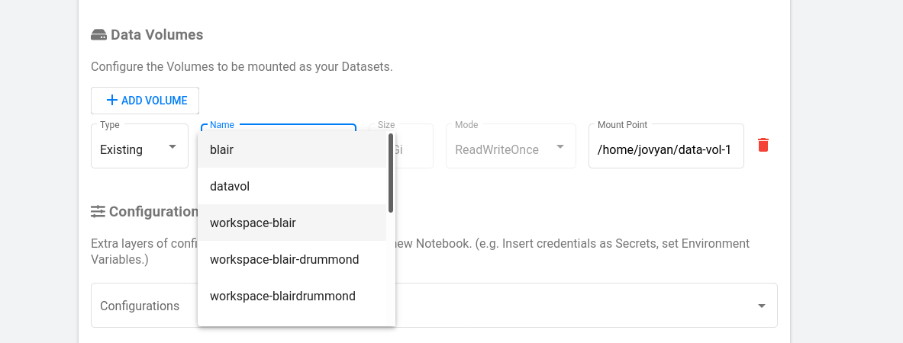

# Stockage

La plateforme propose différents types de stockage, conçus pour différents types
de cas d'utilisation. Par conséquent, cette section vous concerne, que vous
soyez en train d'expérimenter, de créer des pipelines, ou d'éditer.

En surface, il existe deux types de stockage :

- des disques (aussi appelés volumes)
- des compartiments (stockage S3 ou "blob")

## Disques

Les disques sont les systèmes de fichiers courants de type disque dur ou SSD.
Vous pouvez monter les disques dans votre serveur Kubeflow, et même si vous
supprimez votre serveur, vous pouvez remonter les disques, car ils ne sont
jamais détruits par défaut. C'est un moyen très simple de stocker vos données,
et si vous partagez un espace de travail avec une équipe, tous les membres
peuvent utiliser le disque du même serveur (comme un lecteur partagé).



C'est un moyen très simple de stocker vos données. Si vous partagez un espace de
travail avec une équipe, tous les membres peuvent utiliser le disque du même
serveur comme un lecteur partagé.

## Compartiments


Les compartiments sont un peu plus compliqués, mais ils présentent trois
avantages :

- Le stockage de grandes quantités de données

  - Les compartiments peuvent être énormes (bien plus grands que les disques
    durs), et ils sont rapides.

- Le partage de données

  - Vous pouvez partager des fichiers à partir d'un compartiment en partageant
    une URL que vouspouvez obtenir par l'intermédiaire d'une interface Web
    simple. C'est une excellente façon de partager des données avec des
    personnes à l'extérieur de votre espace de travail.

- L'accès à la programmation

  - Plus important encore, il est beaucoup plus facile pour les pipelines et les
    navigateurs Web d'accéder aux données provenant de compartiments que d'un
    disque dur. Donc, si vous voulez utiliser des pipelines, il faut d'abord les
    configurer pour qu'ils fonctionnent avec un compartiment.

# Stockage en compartiment

Nous avons quatre types de stockage en compartiment.

**Libre-service :**

| storage type                                                        | description                                                                                        |
| :------------------------------------------------------------------ | :------------------------------------------------------------------------------------------------- |
| [Minimal](https://minimal-tenant1-minio.covid.cloud.statcan.ca)     | By default, use this one. It is HDD backed storage.                                                |
| [Premium](https://premium-tenant1-minio.covid.cloud.statcan.ca)     | Use this if you need very high read/write speeds, like for training models on very large datasets. |
| [Pachyderm](https://pachyderm-tenant1-minio.covid.cloud.statcan.ca) | You will only need this if you're using Pachyderm Pipelines.                                       |

**Accessible au grand public :**

[Public (en lecture seule)](https://datasets.covid.cloud.statcan.ca)

## Libre-service

Dans chacune des trois options de libre-service, vous pouvez créer un
compartiment personnel. Pour vous connecter, il vous suffit d'utiliser votre
**OpenID**.


Une fois que vous êtes connecté, vous pouvez créer un compartiment personnel
selon le format `prenom-nom`.


<!-- prettier-ignore -->
!!! danger "Cannot yet share files from Minio with OpenID"
    Due to a [bug in Minio](https://github.com/minio/minio/issues/8935) you
    cannot share files yet. This will hopefully be resolved soon. In the
    meantime, it _does_ work if you use your access key and secret key, which
    you can get from Kubeflow.

## Partage

Vous pouvez facilement partager des fichiers individuels. Utilisez simplement
l'option "partager" pour un fichier particulier, et vous recevrez un lien que
vous pourrez envoyer à un
 collaborateur.


## Accès à la programmation

Nous travaillons actuellement à un moyen de vous permettre d'accéder à votre
stockage de compartiment par l'intermédiaire d'un dossier dans votre bloc-notes,
mais en attendant, vous pouvez y accéder par programme en utilisant l'outil de
ligne de commande `mc`, ou par l'intermédiaire des appels d'API S3 dans R ou
Python.

<!-- prettier-ignore -->
!!! danger "Configuration Kuberflow requise"
    Si vous souhaitez activer le stockage en compartiment pour votre bloc-notes,
    sélectionnez "Injecter les justificatifs d'identité pour accéder au stockage
    d'objets MinIO" à partir du menu **Configurations** lorsque vous créez votre
    serveur. Sinon, votre serveur ne saura pas comment se connecter à votre
    stockage personnel.
    

<!-- prettier-ignore -->
!!! tip "Voir les exemples de blocs-notes!"
    Un modèle est fourni pour se connecter dans `R`, `python`, ou par la ligne
    de commande fournie dans `jupyter-notebooks/self-serve-storage`. Vous pouvez
    copier-coller et modifier ces exemples. Ils devraient répondre à la plupart
    de vos besoins.

### Connexion à l'aide de `mc`

Pour vous connecter, exécutez la commande suivante (remplacer
`NOMCOMPLET=blair-drummond` par votre `nom-prénom` réel) :

```sh
#!/bin/sh
NOMCOMPLET=blair-drummond
# Obtenir les justificatifs d'identité
source /vault/secrets/minio-minimal-tenant1
# Ajouter le stockage sous le pseudonyme "minio-minimal"
mc config host add minio-minimal $MINIO_URL $MINIO_ACCESS_KEY $MINIO_SECRET_KEY
# Créer un compartiment à votre nom
# NOTE : Vous pouvez *uniquement* créer des compartiments nommés avec votre PRÉNOM-NOM.
# Tout autre nom sera rejeté.
# Compartiment privé ("mb" = "créer compartiment")
mc mb minio-minimal/${NOMCOMPLET}
# Compartiment partagé
mc mb minio-minimal/shared/${NOMCOMPLET}
# Voilà! Vous pouvez maintenant copier des fichiers ou des dossiers!
[ -f test.txt ] || echo "Ceci est un test" > test.txt
mc cp test.txt minio-minimal/${NOMCOMPLET}/test.txt
```

Maintenant, ouvrez le document
[minimal-tenant1-minio.example.ca](https://minimal-tenant1-minio.example.ca),
Vous y verrez votre fichier de test.

Vous pouvez utiliser `mc` pour copier des fichiers vers/depuis le compartiment.
Cette opération est très rapide. Vous pouvez également utiliser `mc --help` pour
voir les autres options qui s'offrent à vous, comme
`mc ls minio-minimal/PRÉNOM-NOM/` pour afficher le contenu de votre
compartiment.

<!-- prettier-ignore -->
??? tip "Autres options de stockage"
    Pour utiliser une de nos autres options de stockage, `pachyderm` ou
    `premium`, remplacez simplement  la valeur `minimal` dans le programme
    ci-dessus par le type dont vous avez besoin.
