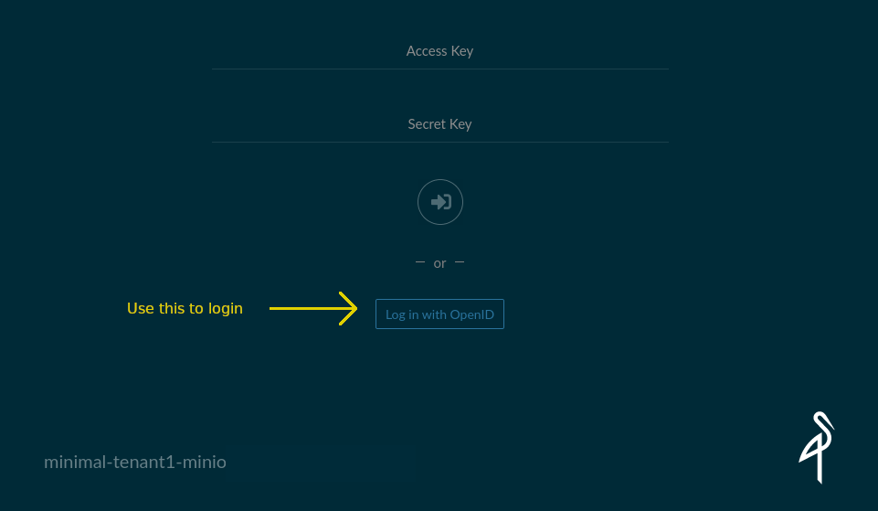

# Stockage

La plateforme propose diff&eacute;rents types de stockage, con&ccedil;us pour
diff&eacute;rents types de cas d'utilisation. Par cons&eacute;quent, cette
section vous concerne, que vous soyez en train d'exp&eacute;rimenter, de
cr&eacute;er des pipelines, ou d'&eacute;diter.

En surface, il existe deux types de stockage :

- des disques (aussi appel&eacute;s volumes)

- des compartiments (stockage S3 ou "blob")

## Disques

Les disques sont les syst&egrave;mes de fichiers courants de type disque dur ou
SSD. Vous pouvez monter les disques dans votre serveur Kubeflow, et m&ecirc;me
si vous supprimez votre serveur, vous pouvez remonter les disques, car ils ne
sont jamais d&eacute;truits par d&eacute;faut. C'est un moyen tr&egrave;s simple
de stocker vos donn&eacute;es, et si vous partagez un espace de travail avec une
&eacute;quipe, tous les membres peuvent utiliser le disque du m&ecirc;me serveur
(comme un lecteur partag&eacute;).

## Compartiments

Les compartiments sont un peu plus compliqu&eacute;s, mais ils pr&eacute;sentent
trois avantages :

- Le stockage de grandes quantit&eacute;s de donn&eacute;es

  - Les compartiments peuvent &ecirc;tre &eacute;normes (bien plus grands que
    les disques durs), et ils sont rapides.

- Le partage de donn&eacute;es
  - Vous pouvez partager des fichiers &agrave; partir d'un compartiment en
    partageant une URL que vouspouvez obtenir par l'interm&eacute;diaire d'une
    interface Web simple. C'est une excellente fa&ccedil;on de partager des
    donn&eacute;es avec des personnes &agrave; l'ext&eacute;rieur de votre
    espace de travail.
- L'acc&egrave;s &agrave; la programmation
  - Plus important encore, il est beaucoup plus facile pour les pipelines et les
    navigateurs Web d'acc&eacute;der aux donn&eacute;es provenant de
    compartiments que d'un disque dur. Donc, si vous voulez utiliser des
    pipelines, il faut d'abord les configurer pour qu'ils fonctionnent avec un
    compartiment.

# Stockage en compartiment

Nous offrons quatre compartiments d'instances de stockage :

**Libre-service**

| storage type                                                        | description                                                                                        |
| :------------------------------------------------------------------ | :------------------------------------------------------------------------------------------------- |
| [Minimal](https://minimal-tenant1-minio.covid.cloud.statcan.ca)     | By default, use this one. It is HDD backed storage.                                                |
| [Premium](https://premium-tenant1-minio.covid.cloud.statcan.ca)     | Use this if you need very high read/write speeds, like for training models on very large datasets. |
| [Pachyderm](https://pachyderm-tenant1-minio.covid.cloud.statcan.ca) | You will only need this if you're using Pachyderm Pipelines.                                       |

**Accessible au grand public**

- [Public (en lecture seule)](https://datasets.covid.cloud.statcan.ca)

## Libre-service

Dans chacune des trois options de libre-service, vous pouvez cr&eacute;er un
compartiment personnel. Pour vous connecter, il vous suffit d'utiliser
**OpenID** comme ci-dessous.

Une fois que vous &ecirc;tes connect&eacute;, vous pouvez cr&eacute;er un
compartiment personnel selon le format `prenom-nom`. Voir la photo ci-dessous.

!!! failure "Cannot yet share files from Minio with OpenID" Due to
[an upstream bug in Minio](https://github.com/minio/minio/issues/8935) you
cannot share files yet. This will hopefully be resolved soon. In the meantime,
it **does** work if you use your access key and secret key, which you can get
from Kubeflow.

## Partage

Vous pouvez facilement partager des fichiers individuels.

## Acc&egrave;s &agrave; la programmation

Pas encore traduit.
