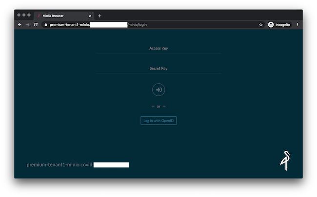

# D&eacute;marrer sur l'espace de travail d'analyse avanc&eacute;e

Le **[portail de l'espace de travail d'analyse avanc&eacute;e](https://portal.covid.cloud.statcan.ca)**
est un excellent endroit o&ugrave; explorer les ressources dont il sera question ici, et y acc&eacute;der.

Nous allons r&eacute;partir les t&acirc;ches standard en trois cat&eacute;gories :

  1. **Exp&eacute;rimentation et analyse**
  2. **Diffusion**
  3. **Production &agrave; grande &eacute;chelle**

Nous aborderons les trois, mais nous nous concentrerons sur les
deux premi&egrave;res, car elles sont les plus largement applicables.

# Pour l'exp&eacute;rimentation et l'analyse

<!--! [Kubeflow](images/logo-kubeflow.png){ : style="max-height:200px"} -->

## Bloc-notes Jupyter

  - `R`, `Python` et `Julia`
  - Choisissez l'unit&eacute; centrale ou la m&eacute;moire vive dont vous avez besoin, petite ou grande, pour votre analyse
  - Partagez votre espace de travail avec votre &eacute;quipe, y compris les donn&eacute;es et les bloc-notes qui s'y trouvent

[**En savoir plus**](1-Experiences/Jupyter)

## Bureaux avec espace de travail ML

Il est plus facile de partager les bloc-notes que les bureaux, mais nous avons aussi la possibilit&eacute;
d'ex&eacute;cuter un bureau complet, muni des applications typiques, directement dans votre navigateur.

[**En savoir plus**](1-Experiences/ML-Workspaces)

# Pour la diffusion

## R Shiny

{ : style="max-height:100px; display : block; margin-left : auto; margin-right : auto;"}

La plateforme est con&ccedil;ue pour accueillir le type d'application &agrave; source ouverte de votre choix.
Nous disposons d'un serveur R-Shiny pour l'h&eacute;bergement des applications R-Shiny

 
Pour cr&eacute;er un tableau de bord R-Shiny, il suffit de soumettre une demande d'extraction (&laquo; pull request &raquo;) GitHub
&agrave; notre [r&eacute;pertoire R-Dashboards GitHub](https://github.com/StatCan/R-dashboards). 

# Pour la production

Si une exp&eacute;rimentation se transforme en produit, l'un des &eacute;l&eacute;ments suivants peut &ecirc;tre n&eacute;cessaire :

  - des pipelines Kubeflow pour les travaux &agrave; haut volume ou uhaute intensit&eacute;
  - des pipelines d'automatisation
 

!!! tip "Demander de l'aide pour la production"
    Le personnel de soutien de l'espace de travail d'analyse avanc&eacute;e est heureux 
    de vous aider pour les cas d'utilisation orient&eacute;s vers la production, 
    et nous pouvons probablement vous faire gagner beaucoup de temps.
    N'h&eacute;sitez pas &agrave; [nous demander pour de l'aide](Aide)!

# Comment obtenir des donn&eacute;es? Comment envoyer des donn&eacute;es?

 - Chaque espace de travail peut &ecirc;tre &eacute;quip&eacute; de son propre stockage.

 - Il existe &eacute;galement des compartiments ("buckets") de stockage pour la publication 
   d'ensembles de donn&eacute;es, pour usage interne ou diffusion plus large.

Nous donnerons un aper&ccedil;u des technologies ici. Des renseignements plus pr&eacute;cis sur
chacune d'entre elles seront fouris dans les sections suivantes. 

!!! example "Parcourir quelques ensembles de donn&eacute;es"
    Parcourez quelques [ensembles de donn&eacute;es](https://datasets.covid.cloud.statcan.ca) ici. 
    Ces ensembles de donn&eacute;es ont &eacute;t&eacute; con&ccedil;us pour stocker des donn&eacute;es largement partag&eacute;es. 
    Il peut s'agir de donn&eacute;es qui ont &eacute;t&eacute; introduites, ou de donn&eacute;es qui seront diffus&eacute;es
    sous forme de produit. **Comme toujours, veillez &agrave; ce qu'il ne s'agisse pas de donn&eacute;es 
    de nature d&eacute;licate.**
